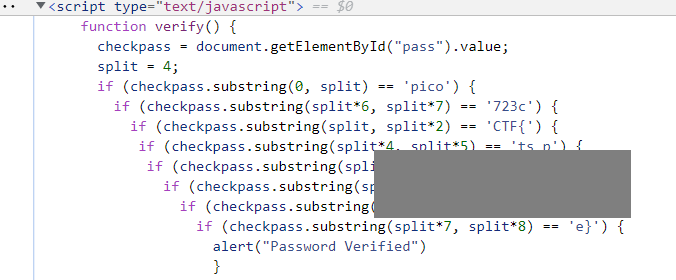

# dont-use-client-side

Can you break into this super secure portal? https://jupiter.challenges.picoctf.org/problem/29835/ or http://jupiter.challenges.picoctf.org:29835

##### Hint

>Never trust the client

## WP

I entered the website and found that it is a login page which needs inputting a "valid credential" to login.

Enter a random input and the page popped up a window informing that the password is incorrect.

This reminds me of the `alert()` function in JS. Combined with the word `client` in the title, I think it is very likely that the verification is done in JS script.

Inspect the source code of the page, we can find the JS script that verifies the password. According to this, we can get the flag reversely.

