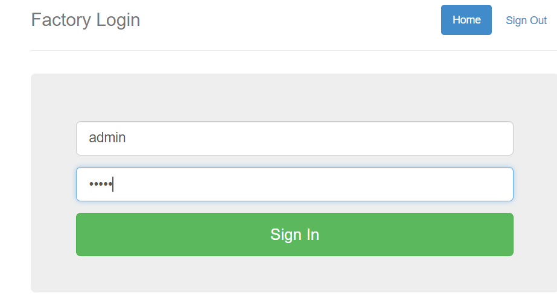
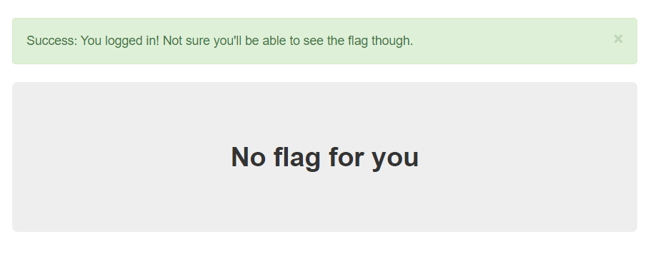
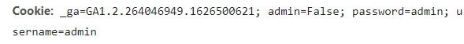
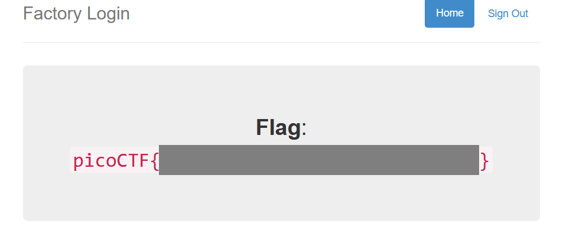

# logon

The factory is hiding things from all of its users. Can you login as Joe and find what they've been looking at? [https://jupiter.challenges.picoctf.org/problem/15796/](https://jupiter.challenges.picoctf.org/problem/15796/) or [http://jupiter.challenges.picoctf.org:15796](http://jupiter.challenges.picoctf.org:15796/)

##### Hint

> Hmm it doesn't seem to check anyone's password, except for Joe's?

## WP

进入网站后，发现是一个登录界面。

随便输入一组用户名和密码，成功登录，但显示**No flag for you**。

根据登录机制，推测是通过Cookie进行的身份判断。打开控制台查看Cookie，发现其中有一个名为admin的属性，而这个属性在请求页面时为False。

使用BurpSuite抓包并更改admin属性为True，即可在页面中看到Flag。

