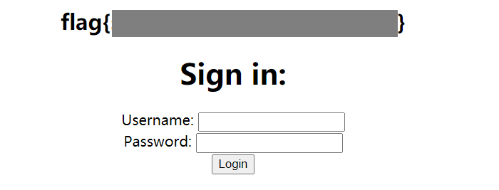

# orm-bad

### Description

I just learned about orms today! They seem kinda difficult to implement though... Guess I'll stick to good old raw sql statements!

```
orm-bad.mc.ax
```

[app.js](http://ctf.infury.org:8000/files/c5868da34feb68d0d59220f82dd90d6a/app.js?token=eyJ1c2VyX2lkIjoxNCwidGVhbV9pZCI6bnVsbCwiZmlsZV9pZCI6Nzl9.YP978Q.bYT15xoPRsshVRXO6AwMdJsLy50)

### Writeup

In `app.js` we can find that the SQL statement is constructed simply by joining the strings together.

```js
app.post('/flag', (req, res) => {
    db.all("SELECT * FROM users WHERE username='" + req.body.username + "' AND password='" + req.body.password + "'", (err, rows) => {
        try {
            if (rows.length == 0) {
                res.redirect("/?alert=" + encodeURIComponent("you are not admin :("));
            } else if(rows[0].username === "admin") {
                res.redirect("/?alert=" + encodeURIComponent(flag));
            } else {
                res.redirect("/?alert=" + encodeURIComponent("you are not admin :("));
            }
        } catch (e) {
            res.status(500).end();
        }
    })
})
```

Obviously there exists a SQL injection vulnerability.

Use the payload of `username = [any string], password = 1' or '1' = '1` we can get the flag.



