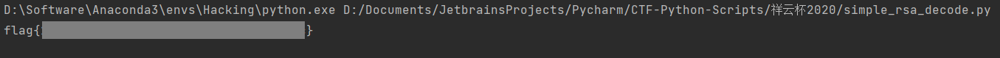

# simpleRSA

Familiar and simple RSA.

[task.txt](http://ctf.infury.org:8000/files/672bd3d3987eabe97c8ce62f94f74804/task.txt?token=eyJ1c2VyX2lkIjoxNCwidGVhbV9pZCI6bnVsbCwiZmlsZV9pZCI6ODd9.YRZQUQ.PM_I-lATswIFz3wsl2zyiO3tpHs)	[task.py](http://ctf.infury.org:8000/files/373437ccef500d14e7e4706f7207fac7/task.py?token=eyJ1c2VyX2lkIjoxNCwidGVhbV9pZCI6bnVsbCwiZmlsZV9pZCI6ODh9.YRZQUQ.ANZjQw96hp0HMwSlWTkCk4oFfj8)

## WP

Open the encryption script and we can find that this encryption uses three primes in RSA.

```python
from Crypto.Util.number import *
import gmpy2

p, q, r = [getPrime(512) for i in range(3)]
n = p * q * r
phi = (p - 1) * (q - 1) * (r - 1)
d = getPrime(256)
e = gmpy2.invert(d, phi)

flag = b"flag{xxxxxxxxxxxxxxxxxxxxxxxxxxxxxxxxxxxx}"

c = pow(bytes_to_long(flag), e, n)

print(e, n)
print(c)
```

Actually, this makes no different in decryption: we still only need to use `pow(c, d, n)` to get the decrypted string.

Now the only problem is finding `d`.

In `task.txt` we can find that `e` is a very large number, so it's very likely that we can use Wiener's attack to get `d` without factoring `n`. My script of Wiener's attack not seems to work when there are three primes, luckily the algorithms used in Wiener's attack is not much complex (mainly **Continued Fraction Expansion Algorithm** and **Asymptotic Fraction Algorithm**), so I wrote another script specifically for this case.

```python
from Crypto.Util.number import long_to_bytes

e = 1072295425944136507039938677101442481213519408125148233880442849206353379681989305000570387093152236263203395726974692959819315410781180094216209100069530791407495510882640781920564732214327898099944792714253622047873152630438060151644601786843683746256407925709702163565141004356238879406385566586704226148537863811717298966607314747737551724379516675376634771455883976069007134218982435170160647848549412289128982070647832774446345062489374092673169618836701679
n = 1827221992692849179244069834273816565714276505305246103435962887461520381709739927223055239953965182451252194768935702628056587034173800605827424043281673183606478736189927377745575379908876456485016832416806029254972769617393560238494326078940842295153029285394491783712384990125100774596477064482280829407856014835231711788990066676534414414741067759564102331614666713797073811245099512130528600464099492734671689084990036077860042238454908960841595107122933173
c = 1079929174110820494059355415059104229905268763089157771374657932646711017488701536460687319648362549563313125268069722412148023885626962640915852317297916421725818077814237292807218952574111141918158391190621362508862842932945783059181952614317289116405878741758913351697905289993651105968169193211242144991434715552952340791545323270065763529865010326192824334684413212357708275259096202509042838081150055727650443887438253964607414944245877904002580997866300452


# Continued fraction expansion algorithm
def continued_fraction(denominator, numerator):
    coefficients = []
    while numerator:
        coefficients += [denominator // numerator]
        denominator, numerator = numerator, denominator % numerator
    return coefficients


# Asymptotic fraction algorithm
def asymptotic_fraction(coefficients):
    denominator = 1
    numerator = 0
    for i in coefficients[::-1]:
        denominator, numerator = denominator * i + numerator, denominator
    return denominator, numerator


data = continued_fraction(n, e)
for x in range(1, len(data) + 1):
    data1 = data[:x]
    d = asymptotic_fraction(data1)[0]
    m = pow(c, d, n)
    flag = long_to_bytes(m)
    if b'flag{' in flag:
        print(flag.decode())
        break
```

Run this script and we can get the flag.



