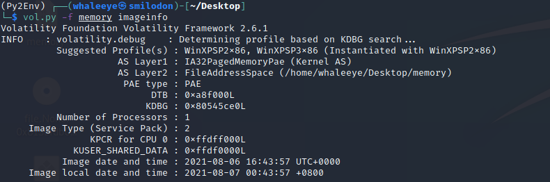
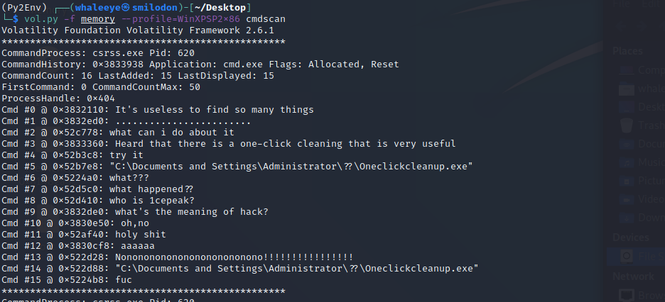
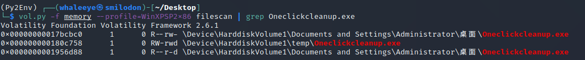
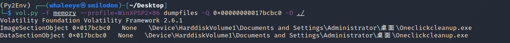
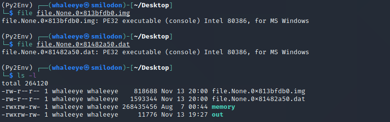
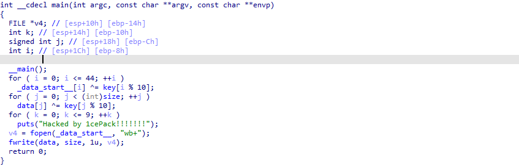
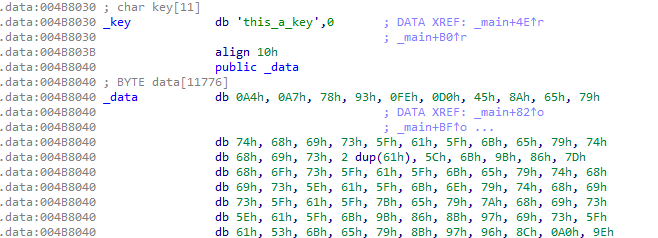
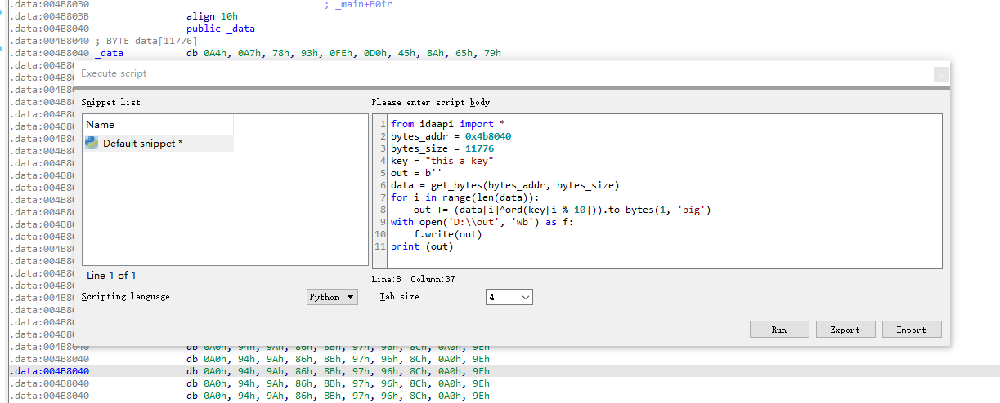
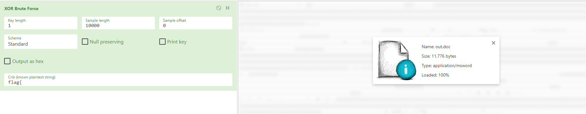
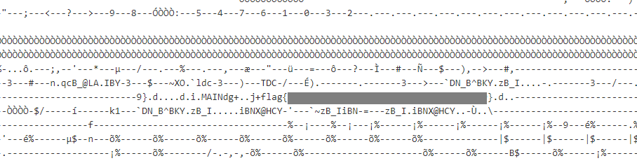

## 考古

### Description

小明在家里翻到一台很古老的xp笔记本，换电池之后发现可以正常开机，但是发现硬盘空间不足。清理过程中却发生了一些不愉快的事情...

[zip](https://compass.ctfd.io/files/b15aa1b677e41c3fbf27d5bd30cb3101/zip?token=eyJ1c2VyX2lkIjoxNCwidGVhbV9pZCI6bnVsbCwiZmlsZV9pZCI6MTA0fQ.YY-uZw.A0pUFpHTPcDveLqx3pfvrr006Es)

### Writeup

Unzip the package and we can find a file named `memory` inside. Check it with volatility first.

Check the history of command line and we can find that the laptop is hacked by a executable file called `Oneclickcleanup.exe`.

Use `filescan` to find the location of the `Oneclickcleanup.exe` and its memory address.

Use `dumpfiles` to dump the files.

Then we get two files, one is a `.img` file and another is a `.dat` file. Both of them are PE32 executable files.

Put the `.dat` file into IDA to disassembly it (this is simply because it's larger). Convert it into C code and we can find that one file was XOR encrypted.

Check the data section we can find the `key` and the encrypted data starting at `0x004b8040`.

Now we only need to decrypt it with the key. Run the script below in IDA and we can get the decrypted file.

Check the decrypted file with CyberChef and we can find that this is a `.doc` file. Open it and we can see the words below.

There is no macro in this `.doc` file. According to the previous steps, guess that XOR might help.

Use CyberChef to XOR brute force the `.doc` file and find the result that has `flag{` in it.

Then we can get the flag in the output.

