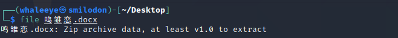
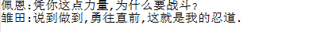
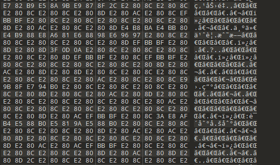
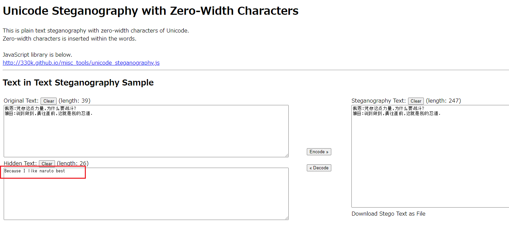
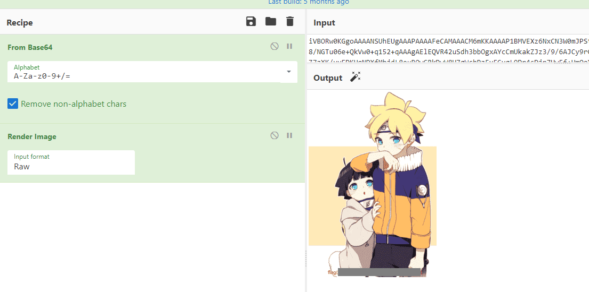

# 鸣雏恋

在喜欢的人面前,我可不能……丢脸啊……因为我,喜欢鸣人君…………

[zip](https://compass.ctfd.io/files/9c33b30bdb9b7c903181a9b6f269e5f8/zip?token=eyJ1c2VyX2lkIjoxNCwidGVhbV9pZCI6bnVsbCwiZmlsZV9pZCI6MTA1fQ.YTGUEg.w6DqOss4KTpFaFnLUrtKKwwm-j8)

## WP

Firstly use `file` command to check the file and we can get that this is actually a `.zip` file.



Decompress the file and in `_rels` we can find two files as below.


`love.zip` is encrypted and obviously the key is in `key.txt`.

Open `key.txt` we can only find two lines from Naruto in simple file editors.



However, if we open it in a hex editor we can find that there are lot of **Unicode zero-width characters** in the file.



For example, `E2 80 8C` corresponds to `U+200C` in Unicode, which is a zero-width non-joiner.

Use a online zero-width character decoder to decode the text and we can get the key of the compressed file.



Then we can decompress `love.zip`.

Open the output folder we will find that there are a lot of pictures in it. However, there are actually only two kinds of pictures.

Regard these two kinds of pictures as `0` and `1`, and we can get a binary information.

The Python script is shown below:

```python
from PIL import Image

binary = []
chr_array = []

for i in range(129487):
    image = Image.open('out/' + str(i) + '.png')
    size = image.size
    if size[0] == 23:
        binary.append(0)
    elif size[0] == 27:
        binary.append(1)
    if i % 8 == 7:
        chr_array.append(chr(int(''.join(str(i) for i in binary[i - 7:i + 1]), 2)))

with open('out.txt', 'w') as f:
    f.write(''.join(chr_array))
```

The output is a data stream of a PNG file.

```
data:image/png;base64,iVBORw0KGgoAAAANSUhEUgAAAPAAAAFeCAMAAACM6mKKAAAAP1BMVEXz6NxCN3W0mJPStaT/8qX////++Og6MEL/6rj/vmXGgWAbFB1VQU2QZ17e0svnqmZwZm8/NGTu06e+QkVw0+q152+qAAAgAElEQVR42uSdh3bbOgxAYcCmUkakZJz3/9/6AJCy9rCbWEzKpplujq+wh1W4/WMHynxWRBH+IeCIRIjk/hVgQLperxQQ/g1gZ7zXK/vvEDKUqNDXfMhjdL8euBOwCRkDwW8H7gWchPzFyFCygL9Dr4sDjp7HwFf+UmQoXcB28OtCVGnAsAgs3gsR3G8EJuTr4iHvvwQZfoJGD6T824BhA1ik/AXIhQHPffRMyvFXAdMOsEoZfhUw7gELcXZdDqLquPvRwLgPfPVkuBHRe8k84ScDO/T7wGxKzUjyUA7x9rOBm33gK7G6c3vg0xr9I4GZnCN60YOVBSxhmPaBrwhJwPxCjCpNwoeAmToBu38D+EpZwC88+1OAgWIcFgLOObATsSE+AuztPf2UxIOJte9sxz4i5a884SEjplcFfAqwo84QDZOZr51Yj2m05B5KLR7rZ9gwbFAdAmY0O46kF40...
```

Decode the BASE64 string and render the picture we can get the picture containing flag.



